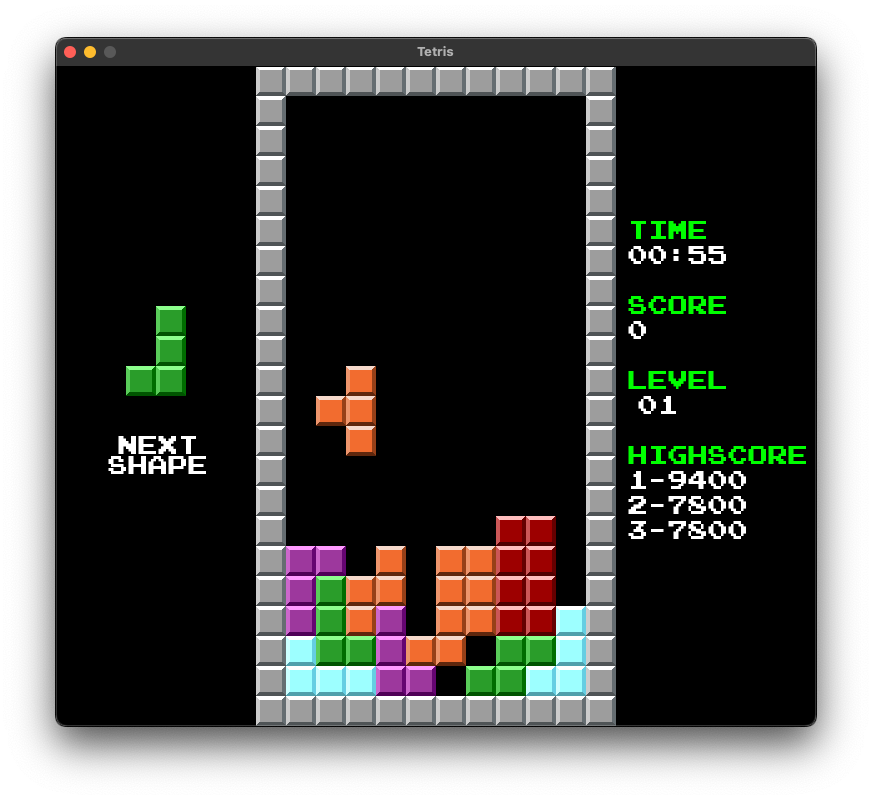
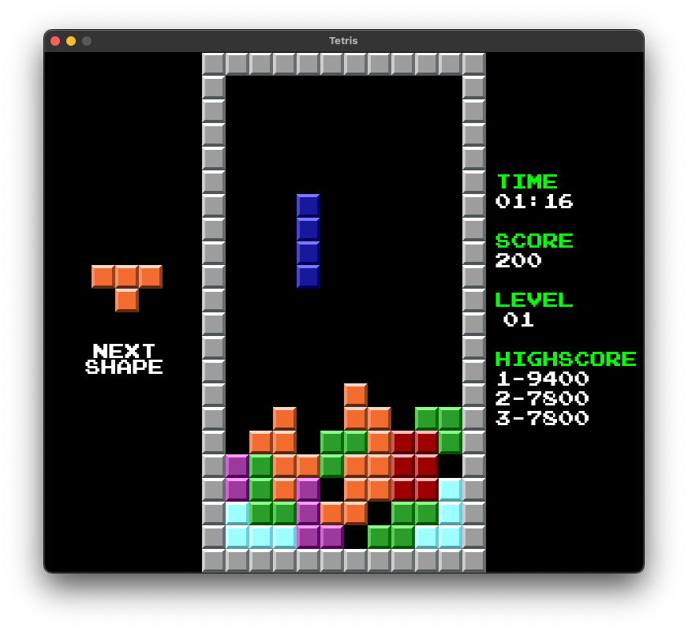

# Python Tetris Clone

Tetris clone made in Python using Pygame by [veranovus](https://veranovus.dev/).
I only own copyright to the code for the game none of the assets are made by me.




## How to Play

In order to play the game you have to have python and pygame installed in your machine, after you install python you can install pygame by calling this command from command line.
```shell
> pip3 install pygame
```
Afterwards you can run the game by simply calling this command.
```shell
> python3 main.py
```

### High Scores

High scores for the game are saved localy at `python-tetris/res/scores.json`.

### Controls

| Keys                            |    Function                     |
|---------------------------------|---------------------------------|
| A, D or Right Arrow, Left Arrow | Move the piece                  |
| W or Up Arrow                   | Rotate the piece                |
| S or Down Arrow or Space        | Force the piece to decent faster|
| R                               | Restart                         |
| ESC                             | Close the game                  |
